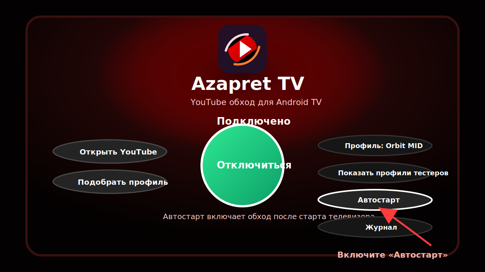

# Azapret TV Youtube

Azapret TV - готовый APK для Android TV / Google TV / YaOS TV.

Приложение запускает локальный VPN на самом телевизоре или приставке и помогает включить обход для YouTube TV. Трафик не отправляется на внешний VPN-сервер приложения: обработка идёт локально на устройстве.


## Что внутри

- `AzapretTV.apk` - готовый APK для установки на Android TV.
- `docs/screenshots/` - скриншоты и подсказки, куда нажимать.
- Исходного Android-проекта в этом репозитории нет, здесь публикуется только готовая сборка и описание.

## Возможности

- Локальный режим через Android `VpnService`.
- Главная кнопка `Подключиться` для быстрого запуска обхода.
- Кнопка `Открыть YouTube` после включения обхода.
- Подбор профиля, если стандартный профиль не подошёл.
- `Автостарт`, чтобы включать обход после старта телевизора.
- Журнал для технических событий и диагностики.

## Скачать

Для установки нужен файл:

```text
AzapretTV.apk
```

SHA256:

```text
CD727A36D33069B6DF24534AA80D3555AA4A9499E81E62C737D3FBEEF4119D85
```

## Как установить

1. Скачайте `AzapretTV.apk`.
2. Запишите APK на флешку.
3. Подключите флешку к телевизору или Android TV приставке.
4. Откройте файловый менеджер на ТВ.
5. Установите APK.
6. Разрешите установку из неизвестных источников, если Android попросит.


## Как включить

1. Откройте `Azapret TV`.
2. На главном экране выберите кнопку `Подключиться`.
3. Подтвердите системное VPN-разрешение Android.
4. После запуска откройте нужное приложение на ТВ.


## Подтверждение VPN

Android всегда показывает системное предупреждение для приложений, которые используют `VpnService`. Это нормально.

Нужно нажать `OK` / `Разрешить`.


## Автостарт

Кнопка `Автостарт` нужна, чтобы Azapret TV мог включать обход после запуска телевизора или приставки.

Используйте её, если не хотите каждый раз открывать приложение вручную после перезагрузки ТВ.



## Если не заработало с первого раза

1. Вернитесь в Azapret TV.
2. Нажмите `Подобрать профиль`.
3. Дождитесь проверки.
4. Выберите рекомендованный профиль.
5. Снова нажмите `Подключиться`.


## Скриншоты

| Экран | Что показывает |
| --- | --- |
|  | Установка APK с флешки или файлового менеджера. |
|  | Главная кнопка `Подключиться`. |
|  | Системное разрешение Android `VpnService`. |
|  | Экран подбора профиля для нестабильных сетей. |
|  | Кнопка `Автостарт` для запуска после старта ТВ. |

## Важно

- Два режима обхода не нужно включать одновременно.
- При первом запуске Android покажет системное VPN-разрешение. Без него приложение не сможет включить локальный обход.
- Если приложение было открыто до включения обхода, закройте его и откройте заново.
- Если телевизор перезагрузился, откройте Azapret TV и проверьте, включён ли обход.
- На разных прошивках Android TV названия кнопок могут немного отличаться.
- Работа зависит от прошивки телевизора, версии Android TV и сети провайдера.

## Что делать при проблемах

- Нажмите кнопку отключения, затем снова `Подключиться`.
- Перезапустите приложение, которое не открывается.
- Перезагрузите телевизор или приставку.
- Попробуйте `Подобрать профиль`.
- Если после перезагрузки обход не включился, проверьте кнопку `Автостарт`.

## Поддержать разработку

Если Azapret TV помог, можно поддержать дальнейшую разработку и тестирование:

```text
USDT TRC20: TSHxLUkcRQno3hJQ1DAcx2UPEbjEMJsSUh
USDT ERC20: 0xcef2832570ebee0395b055127ca14b069916c70d
BTC:        1GdFQj3PZEJvPY6zHXT8j8brnB59bHHVs7
```

## Отказ от ответственности

Приложение предоставляется как есть. Используйте его только там, где это разрешено вашими законами, правилами сети и условиями сервисов.
