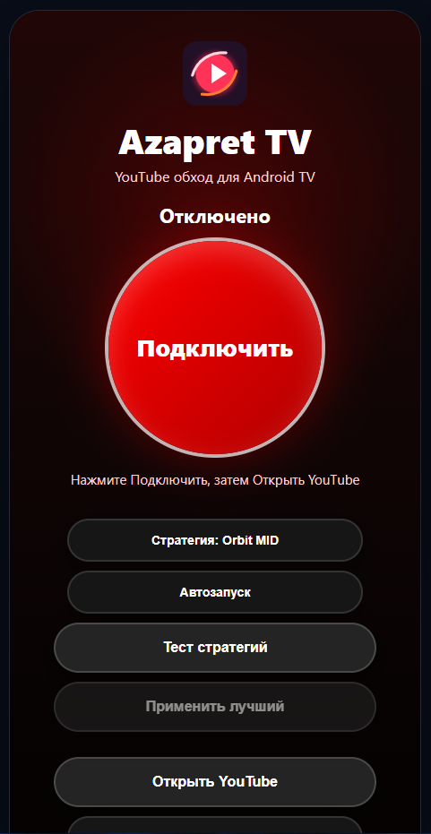
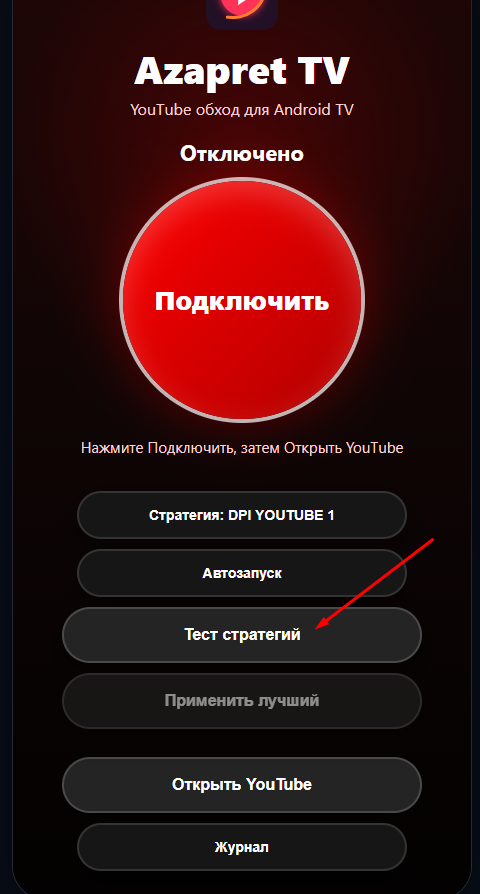
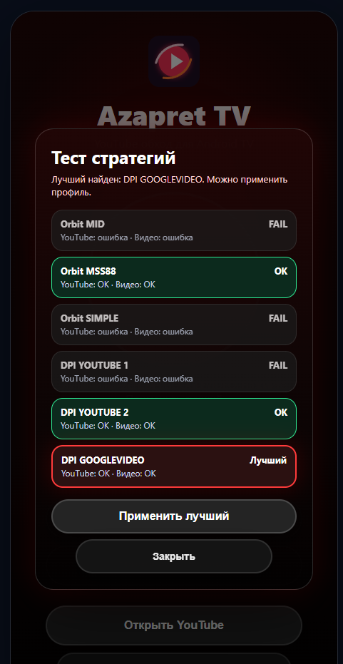
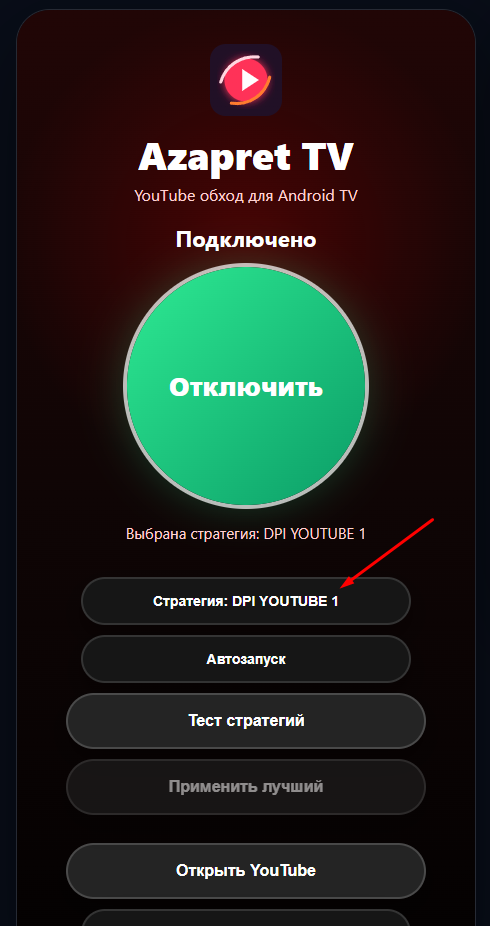
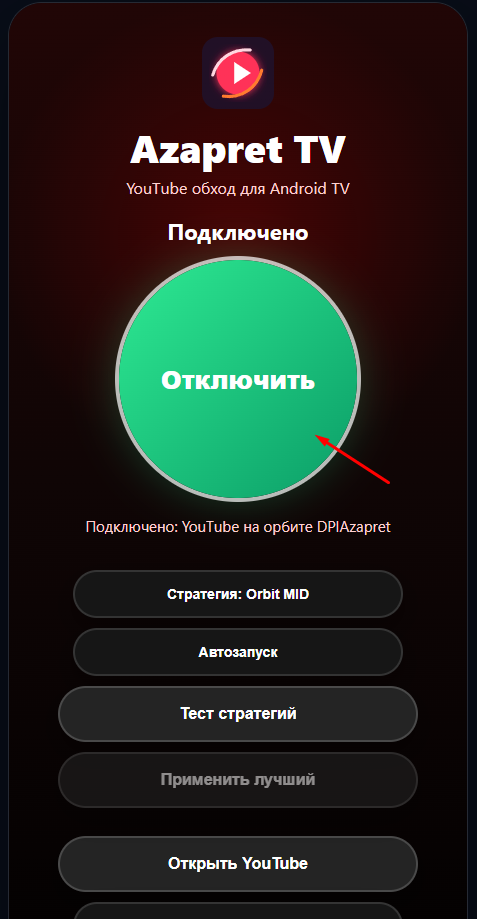
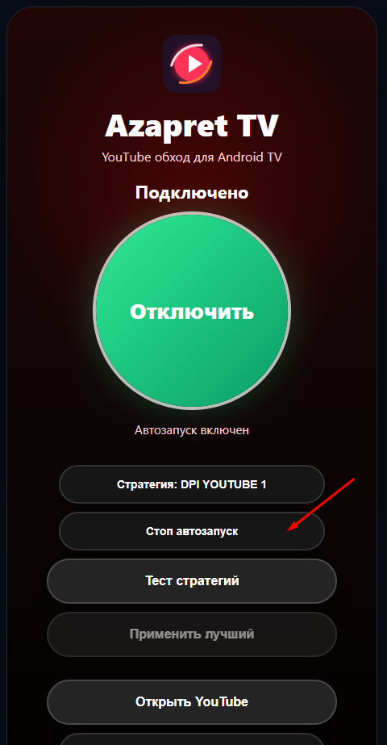

# Azapret TV Youtube

Azapret TV - готовый APK для Android TV / Google TV / YaOS TV.

Приложение запускает локальный обход на самом телевизоре или приставке через Android `VpnService`. Трафик не отправляется на внешний VPN-сервер приложения: обработка идёт локально на устройстве.

## Скачать

Для установки нужен файл:

```text
AzapretTV.apk
```

SHA256:

```text
CD727A36D33069B6DF24534AA80D3555AA4A9499E81E62C737D3FBEEF4119D85
```

## Как пользоваться

Первым делом после запуска нужно сделать `Тест стратегий`. Это подбирает рабочую стратегию под вашу сеть и провайдера.

После теста нужно подключиться и проверить, работает ли YouTube. Если YouTube открывается и видео запускается, можно включить `Автозапуск`. Тогда обход будет запускаться при каждом старте телевизора.

## 1. Откройте Azapret TV

На главном экране видны основные кнопки:

- `Подключить` - включает обход.
- `Стратегия` - переключает текущую стратегию вручную.
- `Автозапуск` - включает запуск обхода после старта ТВ.
- `Тест стратегий` - проверяет стратегии и ищет лучшую.
- `Применить лучший` - применяет найденную стратегию после теста.
- `Открыть YouTube` - открывает YouTube TV.
- `Журнал` - показывает технические события.



## 2. Нажмите Тест стратегий

Сначала выберите кнопку `Тест стратегий`.

Во время теста приложение проверяет доступность YouTube API и googlevideo через разные стратегии. Это нужно, потому что на разных провайдерах и прошивках Android TV может работать разный профиль.



## 3. Дождитесь результата теста

После проверки появится окно со списком стратегий.

В окне видно:

- какие стратегии не прошли проверку;
- какие стратегии дали `OK`;
- какая стратегия выбрана как `Лучший`;
- кнопку `Применить лучший`.

Нажмите `Применить лучший`, чтобы сохранить найденную стратегию.



## 4. Проверьте выбранную стратегию

После применения лучшей стратегии на главном экране будет показано, какая стратегия выбрана.

Если стратегия не подошла, можно нажимать кнопку `Стратегия` и переключать профили вручную, затем снова проверять работу YouTube.



## 5. Подключитесь и проверьте YouTube

Нажмите `Подключить`.

При первом запуске Android может показать системное окно разрешения VPN. Это нормально для приложений на базе `VpnService`. Нужно нажать `OK` / `Разрешить`.

Когда статус станет `Подключено`, нажмите `Открыть YouTube` и проверьте:

- открывается ли YouTube TV;
- загружается ли главная страница;
- запускается ли видео;
- нет ли бесконечной загрузки.

Если YouTube не работает, вернитесь в Azapret TV, повторите `Тест стратегий` или переключите `Стратегия` вручную.



## 6. Включите Автозапуск

Если YouTube работает нормально, нажмите `Автозапуск`.

После включения кнопка изменится на `Стоп автозапуск`. Это значит, что Azapret TV будет пытаться запускать обход при каждом старте телевизора или приставки.

Автозапуск стоит включать только после проверки, что выбранная стратегия действительно работает.



## Если не работает

- Запустите `Тест стратегий` ещё раз.
- Нажмите `Стратегия` и попробуйте другой профиль.
- Нажмите `Отключить`, затем снова `Подключить`.
- Закройте YouTube TV полностью и откройте заново через кнопку `Открыть YouTube`.
- Перезагрузите телевизор или приставку.
- Откройте `Журнал`, если нужно посмотреть технические события.
- Если после перезагрузки обход не запускается, проверьте, включён ли `Автозапуск`.

## Важно

- Не включайте одновременно несколько приложений для обхода/VPN.
- Android всегда показывает системное VPN-разрешение для приложений на базе `VpnService`.
- Названия системных кнопок могут отличаться на разных Android TV / Google TV / YaOS TV.
- Работа зависит от прошивки телевизора, версии Android TV и сети провайдера.
- Если YouTube был открыт до подключения, закройте его и откройте заново после подключения.

## Поддержать разработку

Если Azapret TV помог, можно поддержать дальнейшую разработку и тестирование:

```text
USDT TRC20: TSHxLUkcRQno3hJQ1DAcx2UPEbjEMJsSUh
USDT ERC20: 0xcef2832570ebee0395b055127ca14b069916c70d
BTC:        1GdFQj3PZEJvPY6zHXT8j8brnB59bHHVs7
```

## Отказ от ответственности

Приложение предоставляется как есть. Используйте его только там, где это разрешено вашими законами, правилами сети и условиями сервисов.
