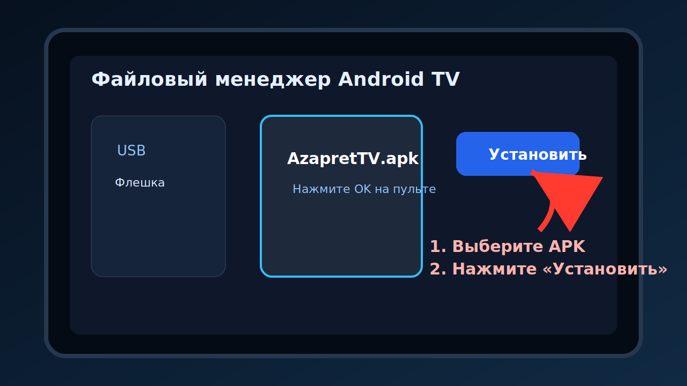
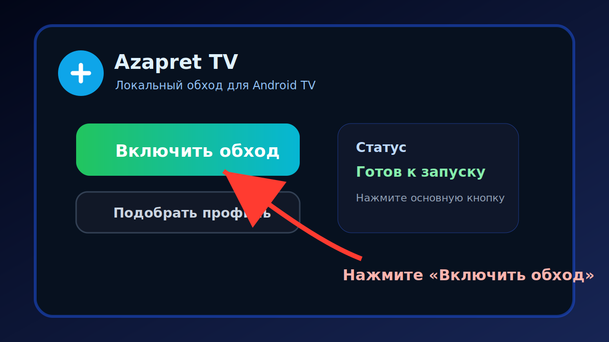
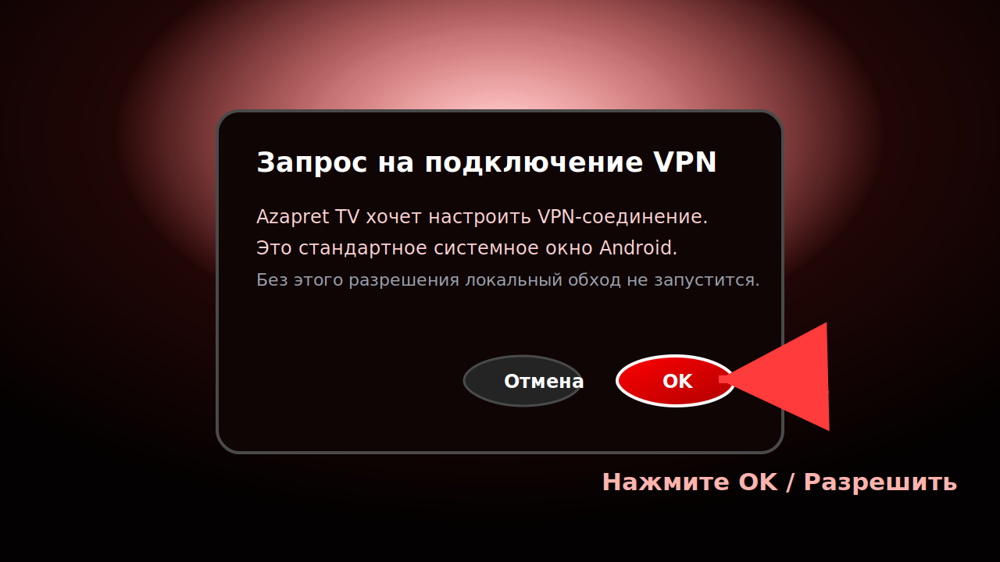
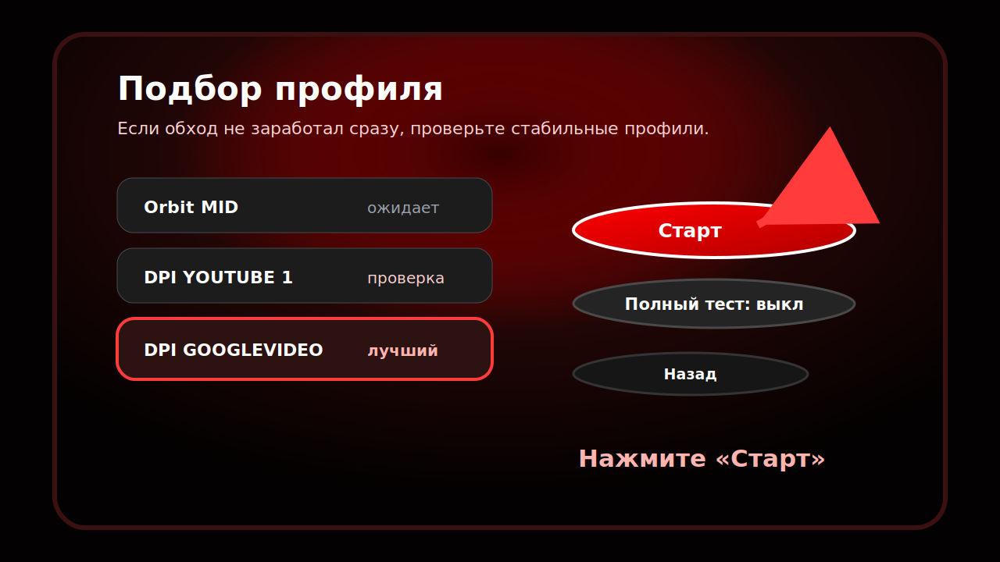

# Azapret TV

Azapret TV - готовый APK для Android TV / Google TV / YaOS TV.

Приложение запускает локальный VPN на самом телевизоре или приставке. Трафик не отправляется на внешний VPN-сервер приложения: обработка идёт локально на устройстве.

## Скачать

В этом репозитории нужен только один файл:

```text
AzapretTV.apk
```

SHA256:

```text
CD727A36D33069B6DF24534AA80D3555AA4A9499E81E62C737D3FBEEF4119D85
```

## Как установить

1. Скачайте `AzapretTV.apk`.
2. Запишите APK на флешку.
3. Подключите флешку к телевизору или Android TV приставке.
4. Откройте файловый менеджер на ТВ.
5. Установите APK.
6. Разрешите установку из неизвестных источников, если Android попросит.



## Как включить

1. Откройте `Azapret TV`.
2. На главном экране выберите кнопку `Включить обход`.
3. Подтвердите системное VPN-разрешение Android.
4. После запуска откройте нужное приложение на ТВ.



## Подтверждение VPN

Android всегда показывает системное предупреждение для приложений, которые используют `VpnService`. Это нормально.

Нужно нажать `OK` / `Разрешить`.



## Если не заработало с первого раза

1. Вернитесь в Azapret TV.
2. Нажмите `Подобрать профиль`.
3. Дождитесь проверки.
4. Выберите рекомендованный профиль.
5. Снова нажмите `Включить обход`.



## Важно

- Два режима обхода не нужно включать одновременно.
- Если приложение было открыто до включения обхода, закройте его и откройте заново.
- Если телевизор перезагрузился, откройте Azapret TV и проверьте, включён ли обход.
- На разных прошивках Android TV названия кнопок могут немного отличаться.

## Что делать при проблемах

- Нажмите `Выключить`, затем снова `Включить обход`.
- Перезапустите приложение, которое не открывается.
- Перезагрузите телевизор или приставку.
- Попробуйте `Подобрать профиль`.

## Отказ от ответственности

Приложение предоставляется как есть. Используйте его только там, где это разрешено вашими законами, правилами сети и условиями сервисов.
